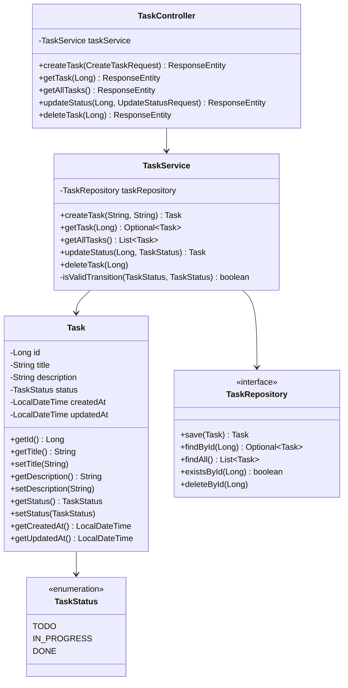
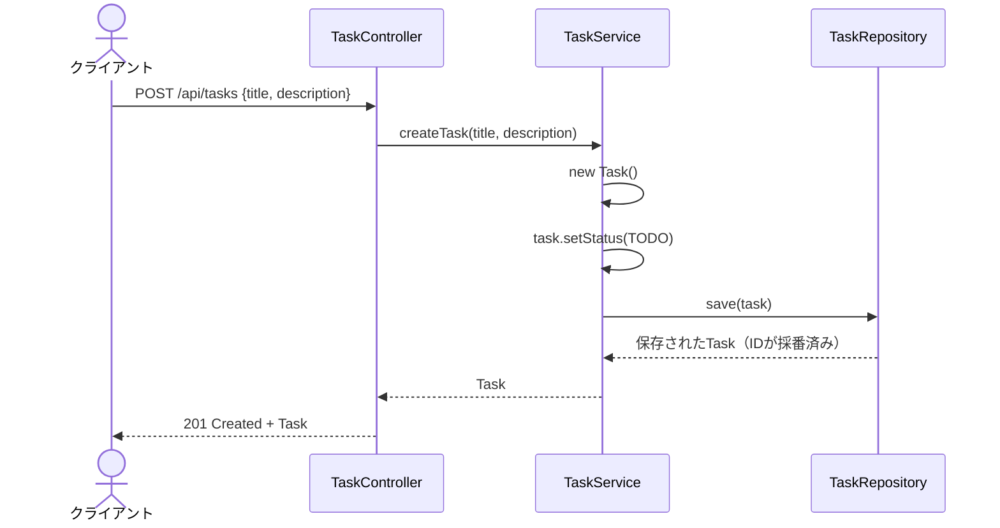
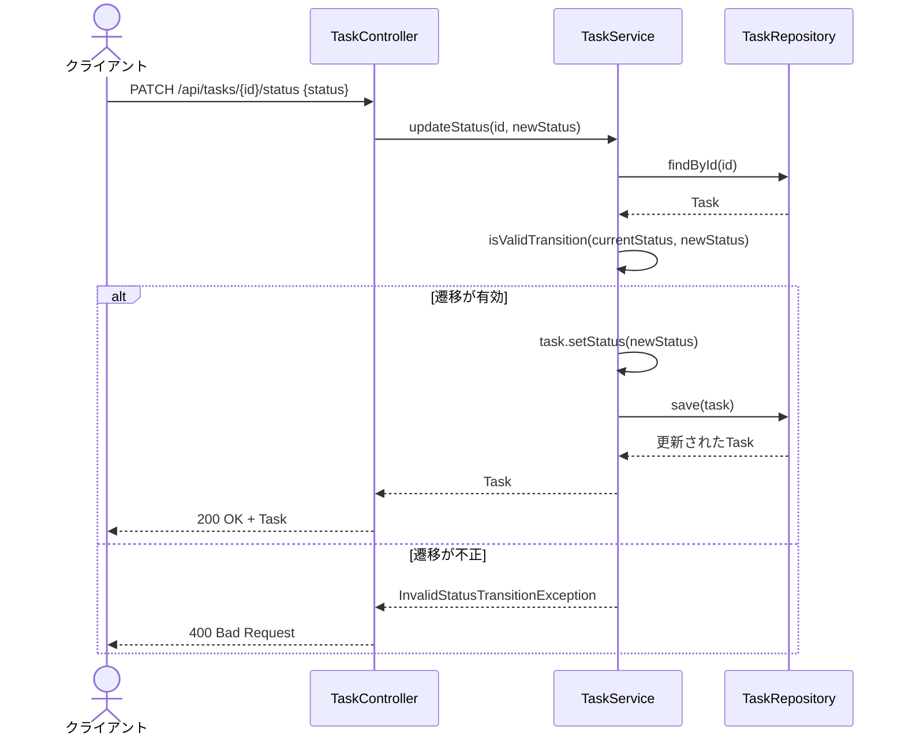

# アーキテクチャ概要

## 1. 全体構成

本アプリケーションはSpring Bootをベースとした3層アーキテクチャを採用している。

```
┌──────────────┐
│   クライアント   │  ブラウザ / APIクライアント
└──────┬───────┘
       │ HTTP (REST)
┌──────▼───────┐
│  Controller層  │  TaskController — リクエストの受付・レスポンスの返却
└──────┬───────┘
       │
┌──────▼───────┐
│  Service層     │  TaskService — ビジネスロジック（ステータス遷移の検証等）
└──────┬───────┘
       │
┌──────▼───────┐
│  Repository層  │  TaskRepository — データの永続化（H2 Database）
└──────────────┘
```

各層は上から下への一方向の依存関係を持ち、下位層が上位層に依存することはない。

## 2. クラス図



## 3. シーケンス図

### タスク作成の流れ



### ステータス更新の流れ



## 4. エラーハンドリング方針

アプリケーションでは以下の例外クラスを使用してエラーを管理する。

| 例外クラス | HTTPステータス | 発生条件 |
|---|---|---|
| TaskNotFoundException | 404 Not Found | 指定されたIDのタスクが存在しない |
| InvalidStatusTransitionException | 400 Bad Request | 許可されていないステータス遷移を試みた |

例外はControllerAdviceで捕捉し、統一的なエラーレスポンス形式で返却する。

## 5. 設計上の判断

- **ステータス遷移の検証をService層に集約**: Controller層ではステータス値の受け渡しのみ行い、遷移ルールの判定はServiceに任せる。これにより、バッチ処理や別のエントリーポイントからタスクを操作する場合も同じルールが適用される。
- **updatedAtの自動更新**: Setter内でupdatedAtを更新する方式を採用。フィールドの変更漏れを防ぐ反面、単純な参照時にもSetterが呼ばれないよう注意が必要。
- **Repositoryのインターフェース化**: 現在はH2 Databaseを使用しているが、Repository層をインターフェースとして定義することで、将来的にPostgreSQL等への切り替えを容易にしている。
